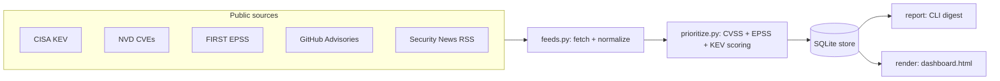

# ThreatScope

A self-hosted, **zero-dependency** threat-intelligence and vulnerability-prioritization dashboard.

ThreatScope aggregates public cyber-threat intelligence (CISA KEV, NVD, EPSS, GitHub Security
Advisories, and security-news RSS) into a local SQLite store, scores CVEs with an
**exploitability-aware model** (CVSS + EPSS + KEV), and produces both a terminal digest and a
self-contained HTML dashboard. It runs entirely on your own machine, needs no API keys for the core
feeds, and has **no third-party dependencies** — just Python 3.9+.

> Built to stay current on emerging threats and answer the question that matters in real
> vulnerability management: *what should I actually fix first?*

---

## Features

- **Multi-source ingestion** — CISA KEV, NVD (new/updated CVEs), EPSS exploitation probabilities,
  GitHub Security Advisories, and security-news RSS (BleepingComputer, The Hacker News, Krebs, CISA).
- **Exploitability-aware prioritization** — transparent, weighted scoring (CVSS + EPSS + KEV) with a
  KEV floor, producing a 0–100 score and a Critical/High/Medium/Low tier with a human-readable rationale.
- **Local SQLite store** — dedupe plus first-seen / last-seen tracking across runs.
- **Self-contained dashboard** — one `dashboard.html` with inline CSS/JS, sortable/filterable,
  works offline, no CDN or network needed to view.
- **CLI digest** — quick top-risk summary in the terminal.
- **Zero dependencies** — Python standard library only. Optional API keys raise rate limits / unlock extra feeds.
- **Schedulable** — Windows Task Scheduler or cron.

## Architecture



## Requirements

- Python 3.9 or newer. Nothing else.

## Install

```bash
git clone https://github.com/<your-username>/threatscope.git
cd threatscope
python -m threatscope update
```

## Usage

```bash
# Fetch all enabled sources, enrich, score, and store
python -m threatscope update

# Print a prioritized digest to the terminal
python -m threatscope report --top 20

# Generate the self-contained HTML dashboard (and open it)
python -m threatscope dashboard --open

# Run offline self-tests (no network)
python -m threatscope selftest
```

Global options: `--config PATH` (default `config.json`), `--data-dir PATH` (default `./data`).

## Scheduling

**Windows (Task Scheduler):**
```powershell
schtasks /Create /SC DAILY /TN "ThreatScope" /TR "python -m threatscope update" /ST 08:00 /RL LIMITED
```

**Linux/macOS (cron) — every day at 08:00:**
```cron
0 8 * * * cd /path/to/threatscope && python3 -m threatscope update >> data/cron.log 2>&1
```

## Configuration

All behavior is controlled by `config.json` (sources, lookback window, scoring weights, output).
Optional environment variables raise limits or enable extra feeds:

| Variable | Purpose |
|---|---|
| `NVD_API_KEY` | Higher NVD rate limits |
| `GITHUB_TOKEN` | Higher GitHub Advisory rate limits |
| `THREATFOX_AUTH_KEY` | Enables abuse.ch ThreatFox IOC feed (free key) |

## Scoring model

```
score = 100 * ( w_cvss * (CVSS / 10) + w_epss * EPSS + w_kev * KEV )
```

- `CVSS` — NVD CVSS v3.1 base score (0–10).
- `EPSS` — FIRST EPSS exploitation probability for the next 30 days (0–1).
- `KEV` — 1 if the CVE is in the CISA Known Exploited Vulnerabilities catalog, else 0.
- A KEV hit also forces a configurable **floor** (default 80) — anything known-exploited is at least High/Critical.

Default weights: CVSS 0.4, EPSS 0.4, KEV 0.2 (all configurable in `config.json`).

## Skills demonstrated

Vulnerability management · threat intelligence · exploitability-aware prioritization (CVSS/EPSS/KEV) ·
data ingestion & normalization · SQLite data modeling · Python (stdlib HTTP, parsing, packaging) ·
report/dashboard generation · automation & scheduling.

## Roadmap

- MITRE ATT&CK technique tagging from advisory text
- Sigma rule references per CVE
- Slack / Discord / email alerting on new KEV entries
- Optional Docker image
- Export to CSV / JSON / STIX

## License

MIT © 2026 Mohit Sharma — see [LICENSE](LICENSE).

## Disclaimer

ThreatScope uses only publicly available data sources and is intended for research and educational
use. Respect each source's terms of service and rate limits.
